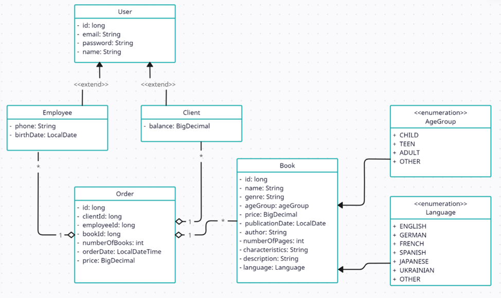

# Book Store. IO

The purpose of this exercise is to check your understanding of the Java input/output system.

Duration: **2** hours

## Description

In this exercise, you will implement "Book Store" with support for reading/writing entities from/to csv files.
The class diagram of the Domain model is shown in the figure below:

You are also given a description of the following interfaces and classes:

* The `CsvStorage` interface provides two methods for reading/writing data from/to a csv file.

* The `Mapper` interface provides static methods for converting text to an object of each entity class and vice versa.

* The `CsvStorageImpl` class implements the `CsvStorage` interface.

* The `MapperImpl` class implements the `Mapper` interface.

> _Note_: Files with a description of objects of entity classes are located in the folder `"src/test/resources/entity/"`

First, proceed to the Domain model classes and implement their content.  
Then, proceed to the `CsvStorageImpl` class and implement its content:

* `public CsvStorageImpl()`  
  Initializes the configuration properties of a csv file with the default values

* `public CsvStorageImpl(Map<String, String> props)`  
  Initializes the configuration properties of a csv file with the received values

* `<T> List<T> read(InputStream source, Function<String[], T> mapper) throws IOException`  
  Returns the contents of the received file as a list of objects. The operation algorithm is as follows: It reads lines
  with data descriptions through the received source stream. Then, it splits each string into an array of `String`
  elements using valuesDelimiter configuration property. Then, it converts the resulting array into an object of the `T` type using the mapper
  parameter, a function that creates an object of the `T` type with field values taken from the given array.

* `<T> void write(OutputStream dest, List<T> value, Function<T, String[]> mapper) throws IOException`  
  Writes the obtained list of objects to the specified dest stream. The operation algorithm is as follows: Each object
  of the `T` type is converted into an array of the String type using the mapper parameter. The elements of the array
  are then collected into a single string using valuesDelimiter to separate them. Then, the resulting string is written
  to a file. The mapper parameter is a function that converts an object of the `T` type into an array of the `String`
  type.

Then, proceed to the `MapperImpl` class and implement its content:

* `Client csvToClient(String[] values)`  
  Gets line from csv file with content appropriate to the Client fields.
  It parses text representation of values and converts to proper data types according to the requirements in Details
  section.

* `Employee csvToEmployee(String[] values)`  
  Gets line from csv file with content appropriate to the Employee fields.
  It parses text representation of values and converts to proper data types according to the requirements in Details
  section.

* `Book csvToBook(String[] values)`  
  Gets line from csv file with content appropriate to the Book fields.
  It parses text representation of values and converts to proper data types according to the requirements in Details
  section.

* `Order csvToOrder(String[] values)`  
  Gets line from csv file with content appropriate to the Order fields.
  It parses text representation of values and converts to proper data types according to the requirements in Details
  section.

* `String[] orderToCsv(Order order)`  
  Gets object of Order with some filled parameters.
  It parses text representation of values and converts to proper data types according to the requirements in Details
  section.

* `String[] bookToCsv(Book book)`  
  Gets object of Book with some filled parameters.
  It parses text representation of values and converts to proper data types according to the requirements in Details
  section.

* `String[] clientToCsv(Client client)`  
  Gets object of Client with some filled parameters.
  It parses text representation of values and converts to proper data types according to the requirements in Details
  section.

* `String[] employeeToCsv(Employee employee)`  
  Gets object of Employee with some filled parameters.
  It parses text representation of values and converts to proper data types according to the requirements in Details
  section.

### Details

* The configuration properties stored in the `CsvStorageImpl ` class are as follows:
    - `String encoding`  
      The encoding used when reading the csv files must be a valid charset. The default value is "UTF-8"
    - `String quoteCharacter`  
      The quote character is used for string data. The default value is '"'
    - `String valuesDelimiter`  
      The column delimiter character is used when reading a csv file. The default value is ","
    - `boolean headerLine`  
      If true, the first line is considered a header and must be ignored. The default value is "true"
* Converting string data to object field values has the following features:
    - Empty string must be converted to `null` for referenced types or to the default value for primitive types.
    - A quoted empty string "" must be converted to an empty string. It is guaranteed that quoted strings will not
      contain the _quoteCharacter_ character.
    - A string representation of a value must be quoted if it contains the _valuesDelimiter_ character.
    - A string representation of a date must be in the format "yyyy-mm-dd". It is guaranteed that a date will not
      contain time-related values.
* Converting object fields to strings has the following features:
    - A `null` must be converted to an empty string.
    - An empty string must be converted to a quoted empty string "".
* The `write()` method of the `CsvStorageImp` class never writes column headers.

### Restrictions

You may not use lambda expressions or streams.
